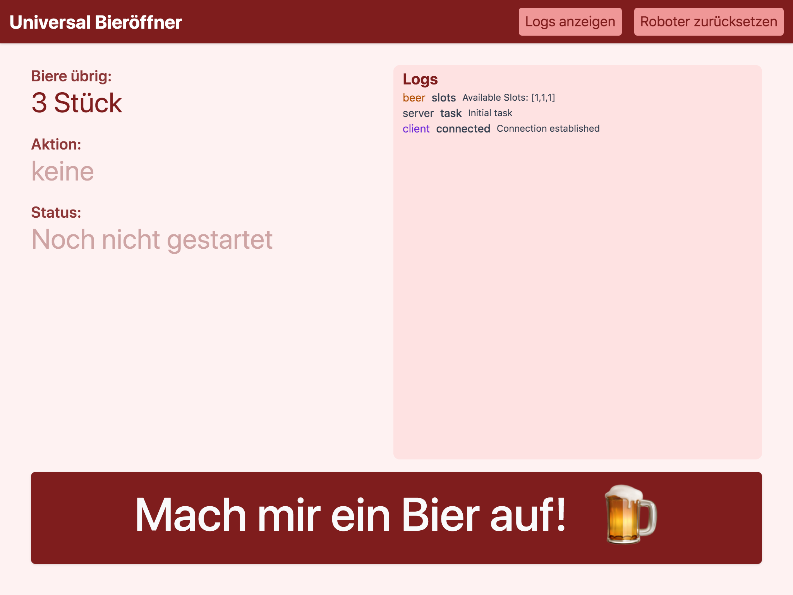

# Robot that opens beer (using [UR5e](https://www.universal-robots.com/products/ur5-robot/))

> Source code for making a Universal Robot 5 open beer  – a fun project I worked on at Leuphana University

## Demo

https://user-images.githubusercontent.com/10093858/174289787-b21d34db-8c48-42bc-b72f-4ad1240fdec6.mp4

<br>

## Robot modes
The script supports two crate modes that can be used, depending on wether a controller is used or not.

### Controlled mode
In this mode, the controller software (see /server) has to be used. The controller knows how many bottles are left in the crate, either by using (optical) sensors or by manual entry. When activated, the robot is then told a specific slot to get a beer from.

### Find mode
This mode does not require the controller software, and can be used with just the Universal Robot Polyscope UI. The robot does not know which slot to pick beforehand and will try every slot until it finds a beer. However, between runs it will remember which slot it last found a beer in. This way it can skip the slots it has already tried / taken a beer from.

<br>

## User Interface (controller)


<br>

## Launching the controller UI
```sh
# Clone repo
git clone https://github.com/capevace/leuphana-robot

# Navigate to folder
cd leuphana-robot

# Install dependencies
npm install

# Start node server
node server/index.mjs
```

The UI will be available at [http://localhost:3000](http://localhost:3000).
