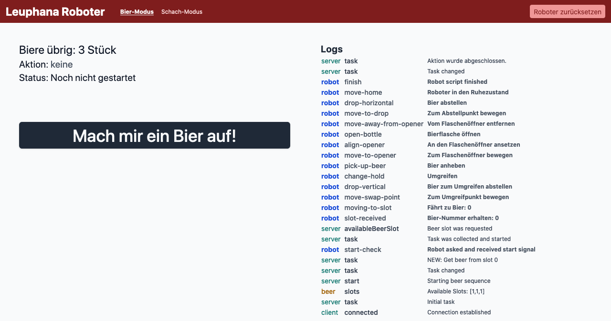
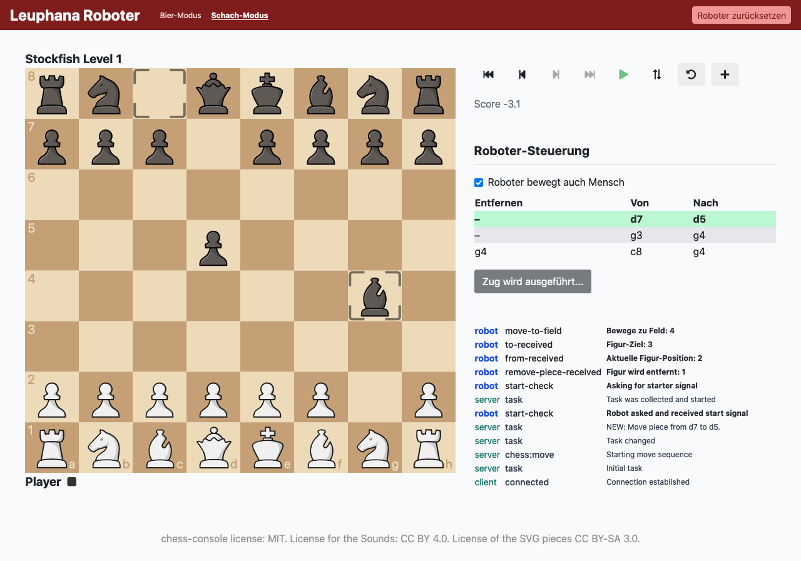

# robot that opens beer & plays chess (using [UR5e](https://www.universal-robots.com/products/ur5-robot/))

> Source code for a project at Leuphana University, making a Universal Robot 5 open beer and play chess.

## Bier-Modus


## Schach-Modus


## Server starten
```sh
# Repo klonen
git clone https://github.com/capevace/leuphana-robot

# In den Ordner navigieren
cd leuphana-robot

# Dependencies installieren
npm install

# Server starten
node server/index.mjs
```

Der Web Service ist dann unter [http://localhost:3000](http://localhost:3000) erreichbar.
